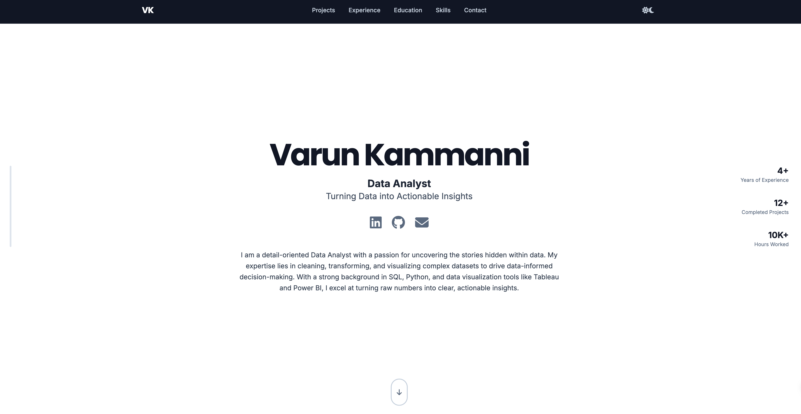

# Varun Kammanni - Data Analyst Portfolio

Welcome to my personal portfolio website showcasing my work as a Data Analyst. This site serves as a comprehensive overview of my professional experience, projects, and technical skills in the field of data analytics.

## About This Project

This repository contains the complete source code for my personal portfolio website. It was created and coded by me, Varun Kammanni, to showcase my projects, skills, and professional experience for the role of a Data Analyst.

This website is a single-page application built from the ground up to be a clean, modern, and interactive summary of my professional journey. The goal was to create a visually appealing and fast-loading site that highlights my passion for data and my technical capabilities in a clear and accessible way.

https://varunkammanni.github.io/ 

## How This Was Built

### Design & Development Approach
The entire site was achieved using a combination of foundational web technologies:

- **HTML5**: For the core structure and content of the site
- **Tailwind CSS**: For a modern, utility-first approach to styling. This allows for a fully responsive design that looks great on desktops, tablets, and mobile devices without writing traditional CSS files
- **Vanilla JavaScript (ES6+)**: For all interactivity, including animations and dynamic content generation. No external frameworks like React or Vue were used, keeping the site lightweight and fast
- **Responsive Design**: Fully responsive layout that works seamlessly across desktop, tablet, and mobile devices
- **Dark/Light Theme**: Implemented a toggle-able dark and light theme system for better user experience

### Key Features Implemented
- **Interactive Navigation**: Smooth scrolling navigation with animated elements
- **Project Showcase**: Interactive project cards with hover effects and preview images
- **Skills Visualization**: Organized display of technical skills with categorized icons
- **Experience Timeline**: Animated timeline showing professional experience
- **Contact Integration**: Direct links to email, phone, and location
- **Social Media Integration**: Links to LinkedIn and GitHub profiles

### Visual Elements
- **Custom Animations**: Scroll-triggered animations and hover effects
- **Professional Imagery**: Company logos and project thumbnails
- **Typography**: Clean, readable fonts (Inter and Poppins) for optimal readability
- **Color Scheme**: Professional color palette with dark/light theme support

## Portfolio Content

### Professional Experience
- **Data Analyst at Soho VFX** (2022-2025): VFX industry analytics and pipeline optimization
- **Freelance Project Coordinator/Data Analyst** (2020-2022): Worked with Jellysmack and Retail Ecommerce Ventures
- **PMO Analyst/Data Analyst at Cognizant** (2014-2018): Healthcare data analysis and BI tool training

### Featured Projects
- Retail Sales Analysis (USA)
- Coal Mining Industry Report
- UK Bank Customer Analysis
- World Demographics Dashboard
- Australian Clothing Industry Analysis

### Technical Skills
- **Programming Languages**: Python, R, SQL
- **Data Visualization**: Tableau, Power BI, Matplotlib, Seaborn
- **Data Processing**: Pandas, NumPy, Beautiful Soup
- **Databases**: MySQL, MongoDB
- **Tools**: Excel, Google Sheets, Jupyter, Git, Apache Airflow

## Technical Implementation

The website is built as a single-page application with the following structure:
- Semantic HTML5 markup for accessibility
- CSS Grid and Flexbox for responsive layouts
- Intersection Observer API for scroll animations
- Local storage for theme persistence
- Optimized images and assets for fast loading

## Contact Information

- **Phone**: +1 (437) 366-1006
- **Email**: varunkammanni@gmail.com
- **Location**: Toronto, Ontario, Canada
- **LinkedIn**: [varunkammanni](https://www.linkedin.com/in/varunkammanni/)
- **GitHub**: [varunkammanni](https://github.com/varunkammanni)

---

*This portfolio website is designed to showcase my data analysis capabilities and professional experience. Feel free to reach out for collaboration opportunities or to discuss data analytics projects.*

